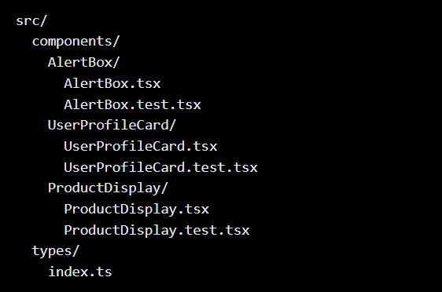

# Lab 9.1: Component Creation & Props

## Objectives

#### By the end of this lab, you will:

- Create reusable React components with TypeScript interfaces for props.
- Implement proper prop handling and validation.
- Use component composition effectively.
- Apply TypeScript best practices for component development.
- Document components with clear prop interfaces.

## Instructions

#### Setup the Project

- [x] Create a new React TypeScript project using Vite
- [x] Create the following folder structure:



### Component Requirements

[x] Create an AlertBox component that can display different types of alerts (success, error, warning, info) with customizable messages.
[x] Create a UserProfileCard component that displays user information with optional sections.
[x] Create a ProductDisplay component that shows product information with configurable display options.

### Activity Tasks

#### Component Implementation:

- [x] Implement each component according to its interface requirements.
- [x] Use proper TypeScript types and interfaces.
- [x] Implement prop validation where appropriate.
- [x] Handle optional props and children correctly.

#### Component Testing:

- [x] Test different prop combinations.
- [x] Verify that components render correctly with various props.

#### Component Composition:

[ ] Create example usage of components working together.
[ ] Demonstrate prop passing between components.
[ ] Show how to handle component nesting.

#### Documentation:

- [ ] Add comments to describe component props.
- [ ] Create example usage documentation.
- [ ] Document any special prop handling or requirements.

#### Example Implementation

Here’s a starting point for the AlertBox component, using Tailwind CSS classes for styling:

```ts
// components/AlertBox/AlertBox.tsx
import React from "react";
import { AlertBoxProps } from "../../types";

export const AlertBox: React.FC<AlertBoxProps> = ({
  type,
  message,
  onClose,
  children,
}) => {
  const alertStyles = {
    success: "bg-green-100 border-green-500 text-green-700",
    error: "bg-red-100 border-red-500 text-red-700",
    warning: "bg-yellow-100 border-yellow-500 text-yellow-700",
    info: "bg-blue-100 border-blue-500 text-blue-700",
  };

  return (
    <div className={`p-4 border-l-4 ${alertStyles[type]}`}>
      <div className="flex justify-between items-center">
        <p>{message}</p>
        {onClose && (
          <button
            onClick={onClose}
            className="ml-4 text-gray-500 hover:text-gray-700"
          >
            ×
          </button>
        )}
      </div>
      {children}
    </div>
  );
};
```

### Example Usage

Here are examples of how to use each component, and an example of the result:

#### AlertBox Example

```ts
<AlertBox
  type="success"
  message="Your profile has been updated successfully!"
  onClose={() => alert("Alert closed")}
>
  <p className="text-sm">You can now continue using the application.</p>
</AlertBox>
```

 => alert(`Editing user ${userId}`)}
>
  <div className="text-sm text-gray-500">Last login: 2 hours ago</div>
</UserProfileCard>;
```


#### ProductDisplay Example

```ts
const product = {
  id: "1",
  name: "Wireless Headphones",
  price: 199.99,
  description: "High-quality wireless headphones with noise cancellation.",
  imageUrl: "https://example.com/headphones.JPG",
  inStock: true,
};

<ProductDisplay
  product={product}
  showDescription={true}
  showStockStatus={true}
  onAddToCart={(productId) => alert(`Added product ${productId} to cart`)}
>
  <div className="text-sm text-gray-500">Free shipping available</div>
</ProductDisplay>;
```


#### Component Composition Example

Here’s how these components could work together:

```ts
const App = () => {
  const [showAlert, setShowAlert] = useState(false);
  const [cartItems, setCartItems] = useState<string[]>([]);

  const handleAddToCart = (productId: string) => {
    setCartItems([...cartItems, productId]);
    setShowAlert(true);
  };

  return (
    <div className="p-4">
      {showAlert && (
        <AlertBox
          type="success"
          message="Product added to cart!"
          onClose={() => setShowAlert(false)}
        />
      )}
      <div className="grid grid-cols-1 md:grid-cols-2 gap-4 mt-4">
        <UserProfileCard user={user} showEmail={true} showRole={true} />
        <ProductDisplay
          product={product}
          showDescription={true}
          showStockStatus={true}
          onAddToCart={handleAddToCart}
        />
      </div>
    </div>
  );
};
```

### Reflection Questions

- How did you handle optional props in your components?
- What considerations did you make when designing the component interfaces?
- How did you ensure type safety across your components?
- What challenges did you face when implementing component composition?

### Submission

Submit your project via a GitHub repository using the Start Assignment link on Canvas.

#### Your submission should include:

- [ ] All component implementations
- [ ] TypeScript interfaces
- [ ] Example usage documentation
- [ ] A README.md file explaining how to use the components
